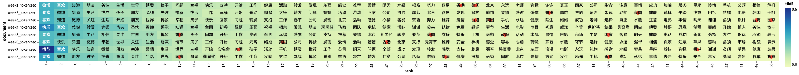

# Text-Analysis-Final-Project
Since the original files, text files after data cleaning and files containing the tokenized text are much larger than Github’s capacity of 25 MB, all of these files can be accessed in the Google Drive using LionMail. 

## Introduction
Censorship, the suppression of speech, public communication and other information, has significant implications on individuals’ freedom to speech in a country. As the Internet rapidly develops in the 21st century, social media becomes the major platform for individuals to share information and speak up. In China, one of the most influential social media platforms that boasts over 500 million registered users as of 2021 is called Sina Weibo. When the platform was first launched in 2009, the Chinese government praised it for enabling people to raise suggestions for the government on the platform. However, the censorship mechanism on Weibo became stronger over the past decade and created enormous fear for people to speak freely on the platform. 
This research intends to investigate how the censorship device operates on Weibo by looking at a database called Weiboscope that collects 111 censored posts in 2012 from Weibo. 
The major research question of this study is: what are the important keywords that trigger the censorship mechanism on Weibo?

## Hypothesis
Based on [previous qualitative and quantitative research](https://papers.ssrn.com/sol3/papers.cfm?abstract_id=2265271) and a variety of new reports,
Weibo tends to censor posts that contain politically sensitive content, especially “the posts that may lead to collective actions.” This can be translated into an intolerance of public criticism of the government. Therefore, this study hypothesized that the posts targeted by the Internet censorship machine contain keywords related to the government and public affairs such as “政府”(government), “国家”(nation), and “党”(party). Furthermore, this study expects that Weibo posts are more likely to be censored if they contain comments on international affairs. Thus it anticipates names of foreign countries as important keywords. 

## Data Collection
This project will analyze the data collected by a data collection system called *[Weiboscope](https://datahub.hku.hk/articles/dataset/Weiboscope_Open_Data/16)*, developed by the research team at the Journalism and Media Studies Centre, The University of Hong Kong (JMSC). The team made use of the Sina Weibo Open API to access the microblog data, and collect the censored posts by frequently revisiting the user’s timeline. The system collected 111 million Weibo posts between January 1, 2012 and June 30, 2012. 
Their sample is made up of three particular groups of microbloggers: 1) less than 10 China Media Project researchers at the University of Hong Kong, who are scholars and active writers on the China media industry. Group 1 users’ timeline was checked every 3 minutes 2) 5,000 users who are the friends of Group 1 users,  mostly Chinese dissident writers, journalists and scholars. The update for Group 2 is run every 6 hours. 3) authenticated VIP status users who have more than 10,000 followers, consist of about 38,000 users. Each update is run once a day for this group. The research team tracked the timelines of these microbloggers by comparing the recently modified timeline with the immediately previous timeline. If missing posts were detected through comparison, the research team will then analyze whether their absences are caused by censorship or voluntary deletion by looking at the API response (the former returns “permission denied”, and the latter returns “Weibo does not exist”). If a post was deleted voluntarily, they were excluded from the data collection to avoid contamination of the truly censored posts.

2-month period data (made up of data of 8 weeks) from Weiboscope’s open data website was downloaded in CSV file format for the purpose of this study, and it consists of around 8 million censored Weibo posts. These CSV files contain various information about the censored posts including time, images and so on. However, since Weibo texts are the only content needed to conduct analysis, this study only keeps the texts and saves them into new files (*e.g.week1_clean.csv*) before data cleaning and analysis. 

## Data Cleaning
Data cleaning is an important step in this study to obtain more accurate results. Stop words removal and tokenization are performed to reduce noise caused by stop words and punctuation marks. 

Two types of stopwords are used in the process of data cleaning. The first kind includes a series of numbers, English letter,  punctuation marks in both English and Chinese. The second type of keywords include a number of Chinese stopwords that are “meaningless” and make the data too noisy and ambiguous. For example,  “一个” means “one [count]” in English, and it is one of the most frequently occurred word shown in the results before this step of cleaning. There are over 100 official stopwords in Chinese, and the full list of stopwords was retrieved by importing the *`stopwordsiso`* package. 

Another type of noise that frequently occurs throughout the texts are the emojis that are usually framed within the [] symbols. To address this problem, this study imports the *`harvesttext`* package, and uses the clean_text( ) function to specifically remove emojis. 

After removing most of the stopwords and symbols that could distract us in the text 
analysis, tokenization is performed to break up the texts into individual tokens that is convenient for us to conduct the TF-IDF test later. To tokenize the texts, *`spaCy`* is installed and used to separate words by adding spaces. The tokenized words then were saved into new files (e.g. week1_tokenized.txt) before the tf-idf test.
The codes used for stopwords removal and tokenization are developed from the internet and coursework content: [Chinese Natural Language (Pre)processing: An Introduction](https://towardsdatascience.com/chinese-natural-language-pre-processing-an-introduction-995d16c2705f), a Chinese blogpost about [Data Cleaning of Weibo Data](https://blog.csdn.net/qq_40200387/article/details/107048316), and Melanie Walsh’s [Text Pre-Processing for Chinese](https://melaniewalsh.github.io/Intro-Cultural-Analytics/05-Text-Analysis/Multilingual/Chinese/01-Preprocessing-Chinese.html).

## Method: TF-IDF Test
Since this study aims to identify the most important keywords among the censored Weibo posts, the major technique used for this purpose is the TF-IDF test. TF-IDF helps identify the most important terms used in each document (in this study, there are 8 documents, with each of them containing censored Weibo data of 1 week). Then, the top 50 most important words are listed out for each document since it is a large sample with several million posts. 

In addition, to test the hypothesis, I zoom in to see particular words that I’m interested in to see if they exist in the top 50 words list and their tf-idf score. 

The codes used for the TF-IDF test comes from Week 11 curriculum TF-IDF with Scikit-Learn.

## Results and Visualization
A heatmap is drawn to show the top 50 most mentioned keywords of the TF-IDF tests. 

There are several findings based on the results: 

First of all, two terms that constantly show up in the heat map in both simplified and traditional Chinese are “微博”(Weibo) and “转发”(retweet). This means that a majority of the censored posts are retweets of other posts. This also points to a problem of this study: since the dataset only includes the text content of the retweets, it is unable to distinguish if these posts are censored because of the retweet content or the content of the original post. 

Secondly, the results also show the time-specific characteristics of the keywords. For example, data of week 4 is collected at the end of January, a time when people celebrate Chinese New Year. Thus, words like “新年”(New Year), “春节”(Spring Festival) and “春晚”(CCTV New Year’s Gala) have higher scores in week 4 than in other weeks. 

In the end, a list of keywords that this study is interested in including '国家(nation)',  '政府'(government), '美国'(America), '台湾'(Taiwan), '香港'(Hong Kong) are marked with red dots in the heatmap. The heatmap shows that these keywords all exist in the top 50 ， In particular, '国家(nation)',  '美国'(America), '香港'(Hong Kong) show high TF-IDF scores in all 8 documents, and in week 5 and week 8,  '香港'(Hong Kong) and '国家’(nation) ranked no.10. Nonetheless, most of the most mentioned words  in these censored Weibo posts do not have political connotations. Most of the keywords ranked above 10 are general terms related to daily life or simply emotional expression. It is worth digging if these terms are more likely to be censored when they are mentioned under certain contexts. 

The code used for drawing the heatmap comes from Eric Monson’s [Possible TF-IDF results visualization](https://github.com/melaniewalsh/Intro-Cultural-Analytics/issues/12). 

## Discussion & Conclusion
### Limitation
There are several limitations of this study that should be discussed, and they may also
point to a direction for future study. 

First of all, unlike English, Chinese language is unique in the way that words are not separated by space. Therefore, the results show some terms that do not make sense in literal meaning after tokenization.  	

Secondly, the results generated by the TF-IDF test using the cleaned data only return general terms rather than terms that refer to specific things. There might be two solutions: one is to conduct more in-depth data cleaning, whichMore advanced model is needed to navigate specific political issues that are targeted by the Chinese censorship machine. 

In the end, this study is insufficient in evaluating the language tone used in the texts including the keywords, and thus it is not able to evaluate if they were censored because of their tone or simply containing the keywords could lead to censorship. It will be optimal to conduct a sentiment analysis on the collected Weibo data to address this problem; however, while sentiment analysis methods on English texts are mature, works on Chinese language are so limited that I am not able to find an effective tool.

### Future direction of Research
	First of all, the data used in this analysis were collected 11 years ago in 2012. However, 2012 was a turning point for China’s political environment. Since Xi came into power as the political leader of China, “social stability” has become a major theme of his governance and more severe censorship is enforced as a method to achieve this goal. Thus, it is expected that the Internet censorship environment on Weibo also changed significantly since 2012.
	Secondly, 

